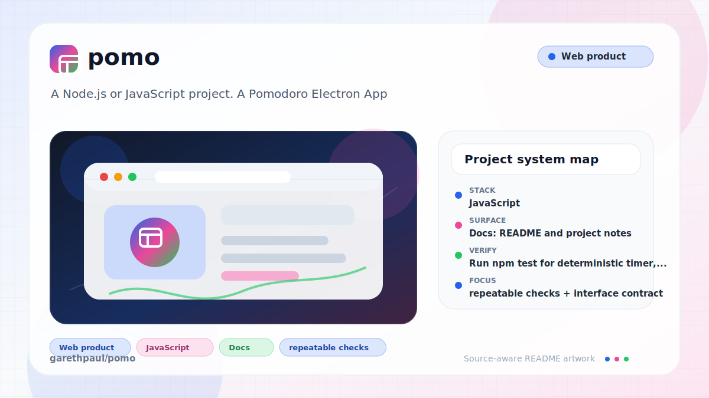

# pomo

<!-- README-OVERVIEW-IMAGE -->


## Overview

`garethpaul/pomo` is a Node.js or JavaScript project. A Pomodoro Electron App

This README is based on the checked-in source, manifests, scripts, and repository metadata on the `master` branch. The project language mix found during review was: JavaScript (5).

## Repository Contents

- `README.md` - project overview and local usage notes
- `CHANGES.md` - notable maintenance changes
- `Makefile` - local verification entry points
- `.github/workflows/check.yml` - locked Node verification and Electron smoke
- `package.json` / `package-lock.json` - exact Electron dependency metadata
- `css` - source or example code
- `js` - source or example code
- `plans` - completed maintenance plans
- `scripts` - deterministic regression tests
- `SECURITY.md` - security reporting and disclosure guidance
- `VISION.md` - project direction and maintenance guardrails

Additional scan context:

- Source directories: css, js, scripts
- Dependency and build manifests: package.json
- Entry points or build surfaces: Makefile, index.js, package.json
- Test-looking files: scripts/test-notification.js, scripts/test-timer.js

## Getting Started

### Prerequisites

- Git
- Node.js 22.12 or newer and npm
- `make` for the local verification wrapper

### Setup

```bash
git clone https://github.com/garethpaul/pomo.git
cd pomo
npm ci
make check
```

The lockfile pins Electron 42.4.0. `npm ci` reproduces that graph, and `npm
audit` should report zero findings before the app is run or packaged.

## Running or Using the Project

- Run `npm start` for the desktop app after `npm ci`.
- On Linux with `xvfb`, run `npm run smoke` for a bounded real application
  launch that exits after the renderer reaches `did-finish-load`.

Detected npm scripts:

- `npm run start` - `electron index.js`
- `npm run smoke` - `xvfb-run -a node scripts/smoke-electron.js`
- `npm run contracts` - `node scripts/check-local-contracts.js`
- `npm run lint` - `node --check index.js && node --check js/main-process.js && node --check js/notification.js && node --check js/timer.js && node --check js/app.js && node --check scripts/test-timer.js && node --check scripts/test-notification.js && node --check scripts/test-main-process.js && node --check scripts/test-app-wiring.js && node --check scripts/check-local-contracts.js`
- `npm run test` - `node scripts/test-timer.js && node scripts/test-notification.js && node scripts/test-main-process.js && node scripts/test-app-wiring.js`
- `npm run build` - `npm run contracts`
- `npm run verify` - `npm run lint && npm test && npm run build`

## Testing and Verification

- GitHub Actions installs the exact lockfile with scripts disabled, audits it,
  and runs the pure gate on Node 22 and Node 24 for pushes and pull requests.
- A separate bounded Ubuntu 24.04 job installs Electron and launches the real
  application under `xvfb`.
- Run `npm test` for deterministic timer, notification, main-process, and
  renderer wiring regression coverage.
- Run `npm run contracts` for the local-only renderer and canonical plan checks.
- Main-process tests cover secure BrowserWindow options, tray positioning and
  toggle behavior, navigation denial, external-link validation, and guarded
  close IPC without importing Electron.
- Privileged close and external-link IPC accepts only the application window's
  current main frame; child, missing-frame, and unrelated senders are rejected.
- An external launch failure, including a synchronous platform throw or
  rejected promise, resolves to `false` inside the main process.
- Preload tests execute the shipped sandbox-compatible bridge and constrain it
  to close and external-link commands.
- Electron application tests cover tray positioning on positive and negative
  displays, About and Quit commands, activation, blur, and close-to-hide
  lifecycle behavior.
- Renderer wiring tests cover start, stop, reset, tab reset, external-link, and
  close-command handlers without launching Electron.
- Renderer wiring tests verify external links only open explicit http/https
  URLs after user clicks.
- Renderer wiring tests also confirm unknown tab hashes do not reset a timer.
- Valid tab switches stop hidden countdowns, reset the destination timer, and
  restore its Start control so stale Stop state cannot outlive the interval.
- Timer tests reject invalid timer durations so zero, negative, fractional, or
  non-numeric values cannot enter countdown state.
- Timer tests confirm a completed timer restarts from its initial duration
  instead of immediately firing another completion notification.
- Timer completion settles interval ownership before notification dispatch, so
  an unexpected renderer hook failure cannot leave the completed countdown
  scheduled.
- Timer tests confirm a paused timer with zero-padded seconds resumes from the
  exact remaining duration instead of concatenating display strings.
- Local contract checks confirm the app window title stays branded as Pomo.
- Local contract checks also verify renderer local asset references point to
  checked-in CSS, JavaScript, image, and audio files.
- Local contract checks verify the desktop notification icon stays a checked-in
  relative asset.
- Denied notification permission is a stable fail-closed state: startup and
  timer completion do not request permission again after the user declines it.
- Notification permission request failures are contained whether the browser
  throws synchronously or rejects its permission promise.
- Notification construction failures are contained after permission is granted
  so timer completion cannot leak an operating-system delivery exception.
- Local contract checks verify icon-only renderer controls keep accessible
  labels and matching tooltip titles.
- Local contract checks verify the npm and Makefile gate wrappers expose lint,
  test, build, verify, and check commands.
- Run `npm run verify` before committing; it checks JavaScript syntax, runs the
  timer, notification, main-process, and renderer wiring tests, then runs the
  static build gate for local-only desktop contracts.
- Run `make lint`, `make test`, `make build`, and `make check` as the
  repository-standard wrappers around the matching npm scripts.
- GitHub Actions runs locked `make check` gates on Node 22 and Node 24 plus the
  Electron 42 smoke for pushes, pull requests, and manual dispatches.

When the required SDK or runtime is unavailable, use static checks and source review first, then verify on a machine that has the matching platform toolchain.

## Configuration and Secrets

- No required secret or credential file was identified. Keep the app local-only unless a future integration explicitly documents its configuration and privacy behavior.

## Security and Privacy Notes

- Review changes touching authentication or token handling; examples from the scan include js/jquery.min.js.
- Review changes touching external API calls or credential-adjacent configuration; examples from the scan include css/bootstrap.min.css, css/ie10-viewport-bug-workaround.css, js/bootstrap.min.js.
- Review changes touching network requests, sockets, or service endpoints; examples from the scan include LICENSE.md, css/bootstrap.min.css, css/ie10-viewport-bug-workaround.css, index.html, and 2 more.
- Review changes touching file, media, JSON, XML, CSV, OCR, or data parsing; examples from the scan include css/bootstrap.min.css, js/jquery.min.js.
- Review changes touching shell execution, subprocess, or dynamic evaluation; examples from the scan include js/jquery.min.js.
- `npm run contracts` verifies that the renderer does not load remote scripts
  and that external links stay behind explicit user clicks.
- `npm run contracts` verifies external-link handling keeps an explicit
  http/https protocol guard.
- `npm run contracts` also checks the renderer window title so placeholder
  Bootstrap titles do not ship.
- `npm run contracts` verifies renderer local asset references stay relative
  and point to checked-in files.
- `npm run contracts` verifies the notification icon stays local and checked in.
- The renderer runs with context isolation, sandboxing, no Node integration, a
  restrictive Content Security Policy, denied navigation/window creation, and
  a two-command preload bridge.

## Maintenance Notes

- Make gates reject caller-controlled `MAKEFILE_LIST`, `MAKEFILES`, and
  `REPO_ROOT` values, pin their shell, and keep checkout paths out of shell
  source before running npm verification.

- See `SECURITY.md` for vulnerability reporting and safe research guidance.
- See `VISION.md` for project direction and contribution guardrails.
- See `CHANGES.md` for maintenance history.
- See `docs/plans/2026-06-08-local-only-contracts.md` for the current
  canonical completed engineering plan.
- See `docs/plans/2026-06-08-main-process-guards.md` for the close IPC guard
  baseline.
- See `docs/plans/2026-06-08-renderer-wiring-tests.md` for the renderer wiring
  regression baseline.
- See `docs/plans/2026-06-09-renderer-tab-reset-guard.md` for the unknown tab
  reset guard.
- See `docs/plans/2026-06-25-tab-switch-timer-ownership.md` for hidden timer
  shutdown and destination-control reconciliation on valid tab switches.
- See `docs/plans/2026-06-09-window-title-contract.md` for the renderer window
  title contract.
- See `docs/plans/2026-06-09-local-asset-reference-contract.md` for the
  renderer local asset contract.
- See `docs/plans/2026-06-09-notification-icon-asset-contract.md` for the
  notification icon asset contract.
- See `docs/plans/2026-06-09-external-link-protocol-guard.md` for the
  renderer external-link http/https guard.
- See `docs/plans/2026-06-09-gate-wrapper-contract.md` for the npm and Makefile
  gate wrapper contract.
- See `docs/plans/2026-06-09-renderer-accessible-controls.md` for icon-only
  renderer control accessible label coverage.
- See `docs/plans/2026-06-10-timer-duration-validation.md` for timer duration
  validation.
- See `docs/plans/2026-06-10-ci-baseline.md` for the hosted GitHub Actions
  baseline.
- See `docs/plans/2026-06-10-hosted-node-validation.md` for the historical
  no-install matrix that the locked Electron validation superseded.
- See `docs/plans/2026-06-12-electron-42-security-migration.md` for the
  Electron 42, preload isolation, lockfile, and hosted smoke migration.
- See `docs/plans/2026-06-12-timer-pause-resume.md` for exact paused-timer
  restart coverage.
- See `docs/plans/2026-06-13-preload-external-url-type-guard.md` for the
  preload-side non-string external URL guard.
- See `docs/plans/2026-06-13-ipc-sender-identity-guard.md` for privileged IPC
  sender binding.
- See `docs/plans/2026-06-16-ipc-main-frame-identity-guard.md` for privileged
  IPC sender and main-frame binding.
- See `docs/plans/2026-06-16-open-external-failure-boundary.md` for external
  launch failure containment.
- See `plans/2026-06-08-notification-regression-tests.md` for the notification
  regression baseline.

## Contributing

Keep changes small and tied to the project that is already present in this repository. For code changes, document the toolchain used, avoid committing generated dependency directories or local configuration, and update this README when setup or verification steps change.
